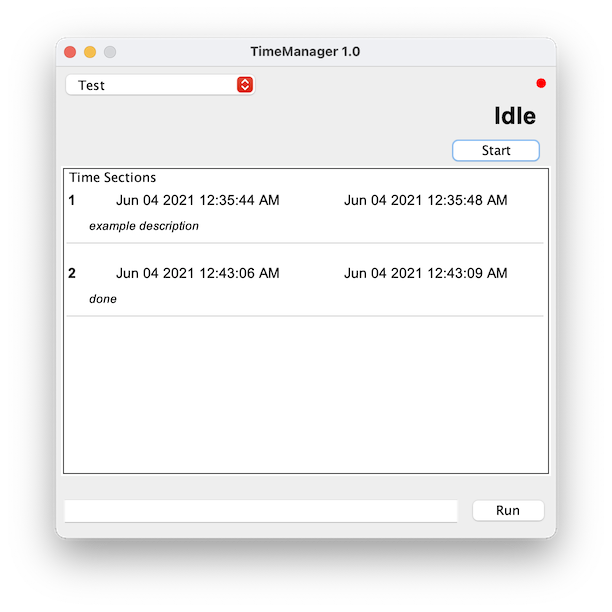

# TimeManager

A simple time keeper. It isn't really intended for use by anyone but me but you can certainly use it if you want. Track the time spent on projects or commission work over extended periods of time, and make useful calculations (for example, the hourly pay rate for a project given a total amount).

Features
* Organize projects into time titles.
* Start a new time section and leave TimeManager open in the background. Then, when done working in that sitting, end the time section and leave a description.
* Run various commands to modify time titles and time sections, or to calculate things.

Run the 'help' command in TimeManager to get started.
